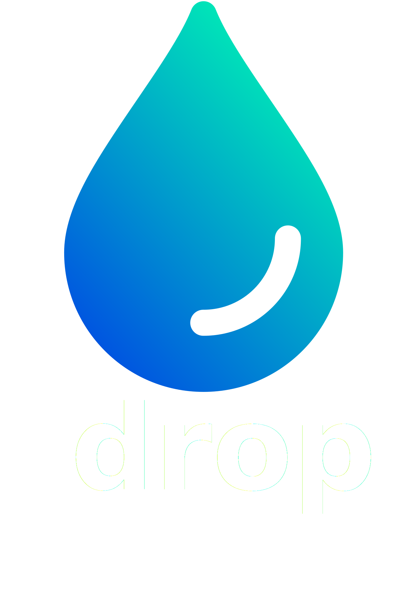</img>
## Junction X Budapest Hackathon - Sustainability Challenge!
Why is it hard to reach individuals with sustainability?
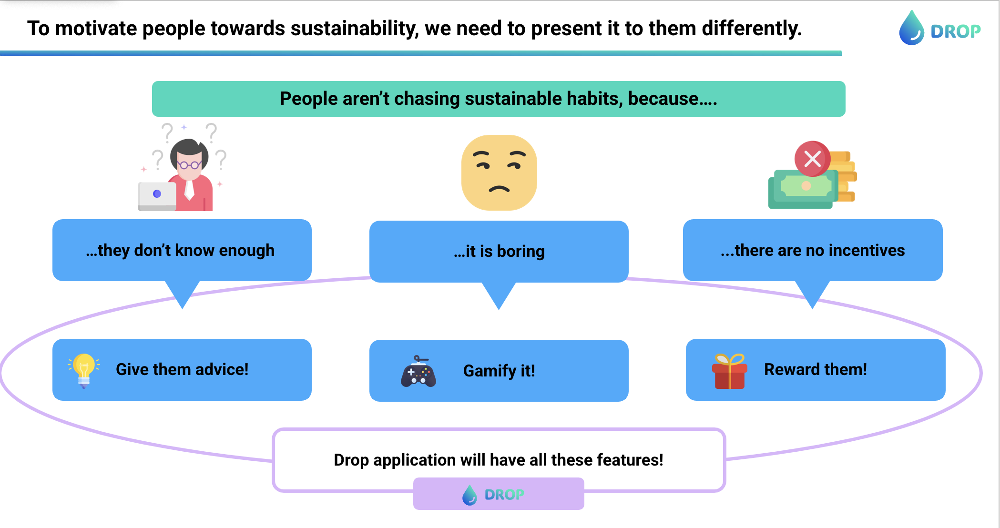
For this reason we introduce,
 
Drop: An app designed to promote sustainable living. We encourage people to take action, so we foster city-based competition to reinforce that every individual can contribute to the larger goal. They also receive rewards to inspire them to develop sustainable habits.
   
Here are some aspects of the user interface, it shows how it works in action:
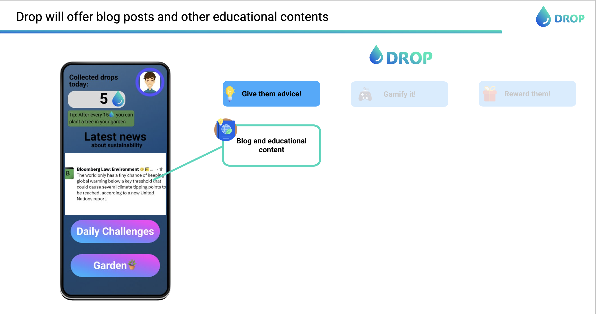
   
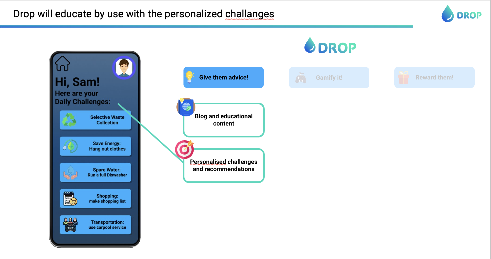
   
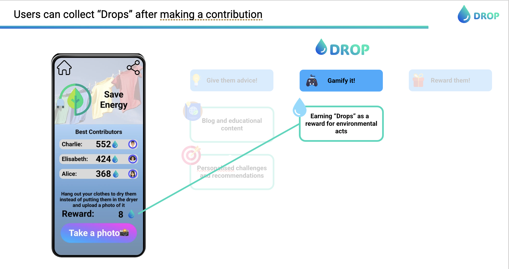
   
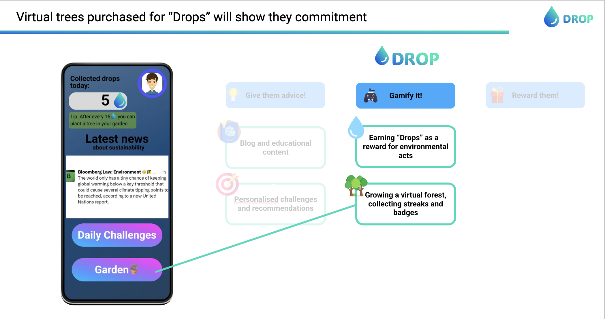
   
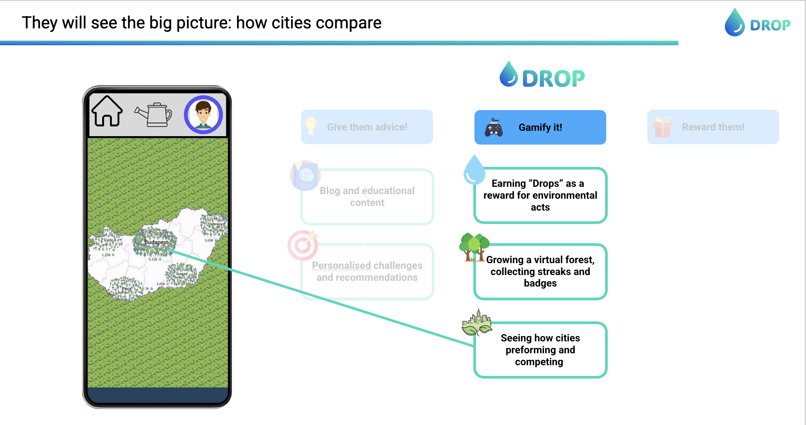
   
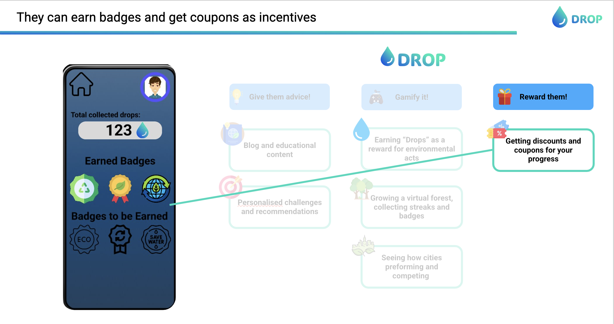
   
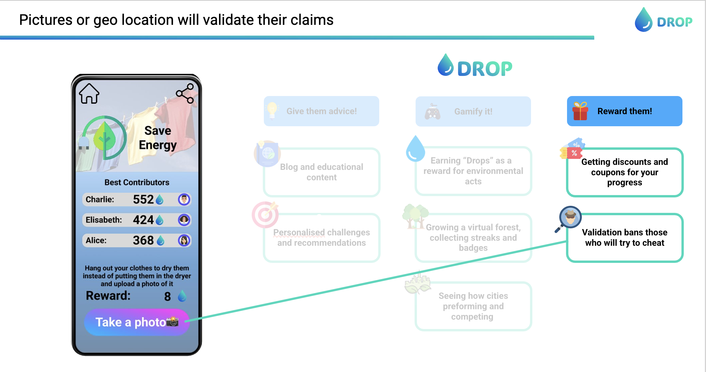
   
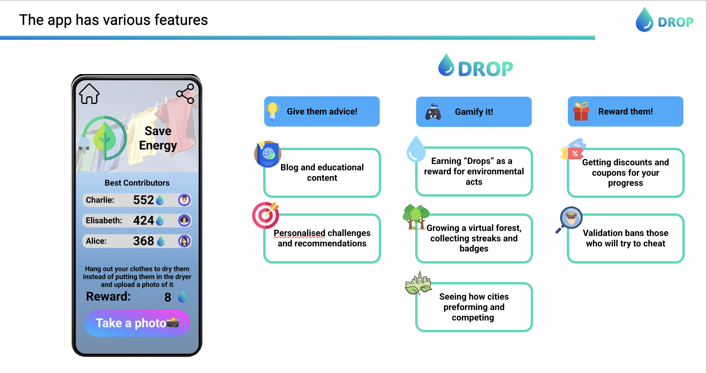
   
After a brief quiz, our app uses AI to offer personalized environmental tips, turning your journey into a gamified experience.
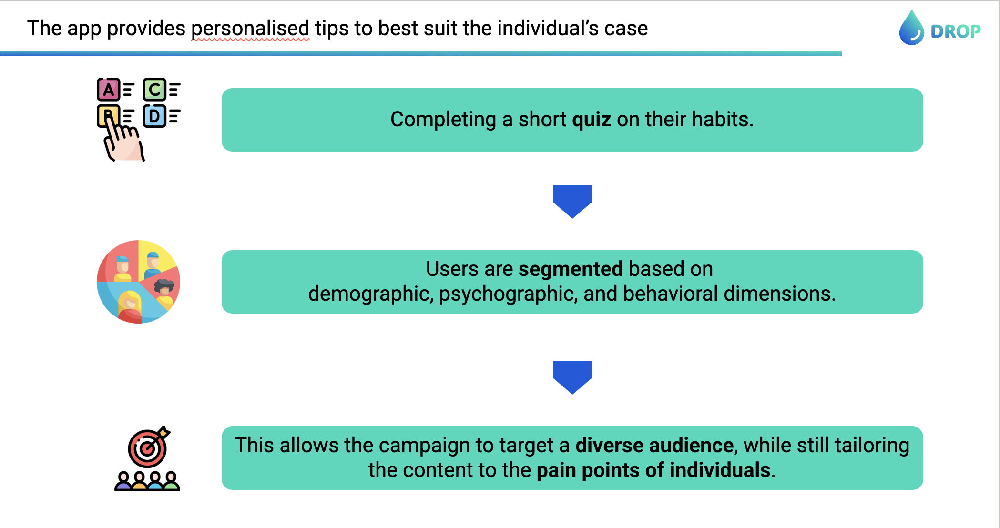
   
We made some estimates regarding the impact.
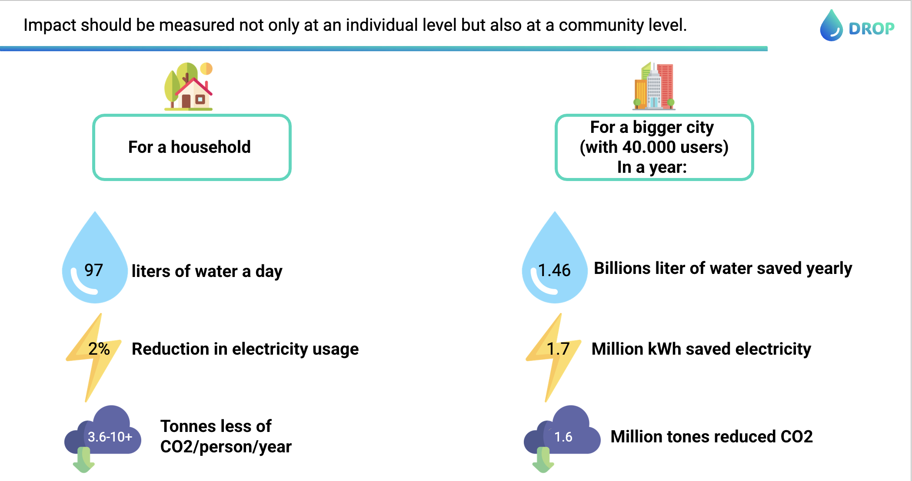
   
The project is designed primarly for Hungary, but we show that it is easily scalable.
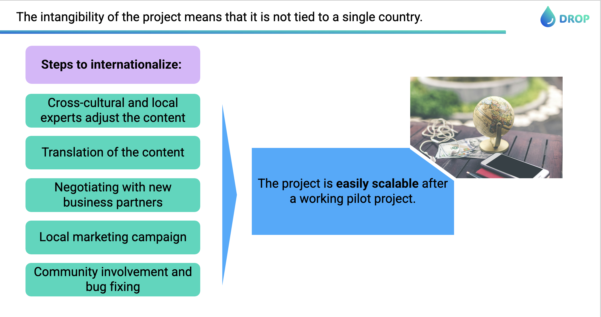